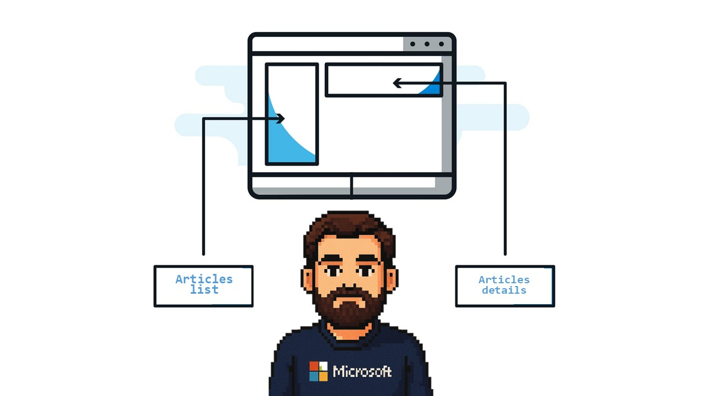
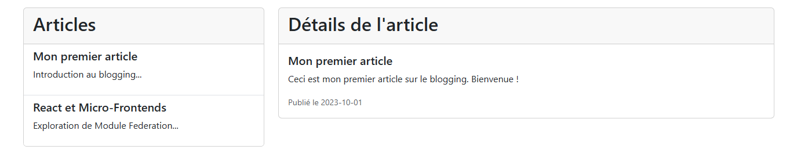
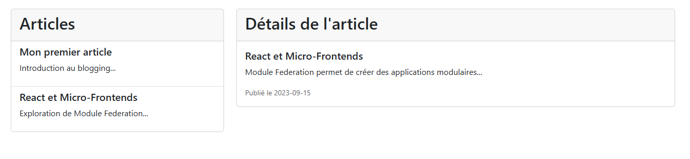

# Mini-projet pour Lab 1 (Blog collaboratif, React)

## Lab 1 : Introduction aux Micro-Frontends
Aperçu
Bienvenue dans **le premier Lab du tutoriel** sur les micro-frontends ! Ce Lab introduit le concept des micro-frontends, une approche architecturale qui divise une application front-end en modules plus petits et indépendants, pouvant être développés, déployés et mis à l'échelle séparément. Dans ce Lab, nous construisons une application simple avec trois micro-frontends :

- **host-app** : L'application principale qui intègre les composants distants.
- **articles-list-app** : Un module distant affichant une liste d'articles.
- **articles-details-app** : Un module distant affichant le contenu détaillé d'un article sélectionné.

L'application inclut un article intitulé " **Introduction aux Micro-Frontends** ", qui explique les bases de cette architecture. Ce Lab pose les fondations pour comprendre les micro-frontends en utilisant React, Webpack Module Federation, et Bootstrap.

### Objectifs d'apprentissage
En complétant ce Lab, vous allez :

- Comprendre les principes de base des micro-frontends et leurs avantages.
- Apprendre à configurer Webpack Module Federation pour permettre le chargement dynamique de modules.
- Utiliser React avec React.lazy et Suspense pour intégrer des composants distants de manière fluide.
- Mettre en place un projet de micro-frontends simple avec plusieurs applications indépendantes.

### Structure du la page




### Structure du projet
Le mini-projet de ce Lab est organisé comme suit :
```
lab-1/
├── packages/
│   ├── host-app/                   # Application hôte (port 9000)
│   │   ├── src/
│   │   │   ├── pages/
│   │   │   │   └── BlogPage.js # Page principale intégrant les composants distants
│   │   │   ├── App.js             # Composant React racine
│   │   │   ├── index.js           # Point d'entrée Webpack
│   │   │   └── index.html         # Modèle HTML
│   │   ├── babel.config.json      # Configuration Babel
│   │   ├── package.json           # Dépendances et scripts
│   │   └── webpack.config.js      # Configuration Webpack avec Module Federation
│   ├── articles-list-app/         # Application distante pour la liste des articles (port 9001)
│   │   ├── src/
│   │   │   ├── ArticlesList.js    # Composant affichant la liste des articles
│   │   │   ├── bootstrap.js       # Point d'entrée pour le chargement asynchrone
│   │   │   ├── index.js           # Point d'entrée Webpack
│   │   │   └── index.html         # Modèle HTML
│   │   ├── babel.config.json
│   │   ├── package.json
│   │   └── webpack.config.js
│   ├── articles-details-app/       # Application distante pour les détails des articles (port 9002)
│   │   ├── src/
│   │   │   ├── ArticleDetails.js  # Composant affichant les détails d'un article
│   │   │   ├── bootstrap.js
│   │   │   ├── index.js
│   │   │   └── index.html
│   │   ├── babel.config.json
│   │   ├── package.json
│   │   └── webpack.config.js
├── README.md                      # Ce fichier
```

**host-app** : S'exécute sur http://localhost:9000 et agit comme l'application principale, chargeant les composants distants depuis articles-list-app et article-details-app.
**articles-list-app** : S'exécute sur http://localhost:9001 et expose le composant ArticlesList.
**article-details-app** : S'exécute sur http://localhost:9002 et expose le composant ArticleDetails.

### Prérequis

Node.js : Version 16 ou supérieure.
Yarn : Version 1.22.22 ou supérieure (préféré à npm pour ce projet).
Un navigateur web moderne (par exemple, Chrome, Firefox).

### Installation
Pour configurer et exécuter le mini-projet du Lab 1, suivez ces étapes :

#### Naviguez vers le répertoire du Lab 1 :
cd microfrontends-tutorial/lab-1

#### Installez les dépendances :
yarn install

Cela installe toutes les dépendances pour host-app, articles-list-app, et article-details-app.

#### Démarrez les serveurs de développement :
yarn start:all

Cette commande utilise concurrently pour exécuter les trois applications simultanément :

**host-app** sur http://localhost:9000
**articles-list-app** sur http://localhost:9001
**article-details-app** sur http://localhost:9002


#### Ouvrez l'application :

Ouvrez votre navigateur et accédez à http://localhost:9000.
Vous devriez voir une page avec une liste contenant un article à gauche et ses détails à droite lorsqu'il est sélectionné.


### Resultat 




### Fichiers clés et concepts
Voici les fichiers clés de ce Lab et les concepts qu'ils illustrent :

#### ArticlesList.js (articles-list-app/src/ArticlesList.js) :

Affiche un seul article intitulé "Introduction aux Micro-Frontends".
Utilise Bootstrap pour le style (par exemple, composants card et list-group).
Illustre un composant distant exposé via Module Federation.
Transmet une fonction de rappel (onArticleSelected) pour communiquer avec l'application hôte.


#### ArticleDetails.js (article-details-app/src/ArticleDetails.js) :

Affiche le contenu détaillé de l'article sélectionné.
Utilise un objet de données simulé pour représenter le contenu de l'article.
Illustre un autre composant distant intégré dans l'application hôte.


#### TutorialPage.js (host-app/src/pages/TutorialPage.js) :

La page principale de l'application hôte, intégrant ArticlesList et ArticleDetails avec React.lazy et Suspense.
Gère l'état pour suivre l'ID de l'article sélectionné.
Montre comment gérer les importations dynamiques avec un indicateur de chargement (spinner).


#### webpack.config.js (dans chaque application) :

Configure Webpack Module Federation pour activer les micro-frontends.
**host-app** définit les remotes pour charger les modules depuis articles-list-app et article-details-app.
**articles-list-app** et **article-details-app** utilisent exposes pour partager leurs composants.
Les dépendances partagées (react, react-dom) sont configurées comme singletons pour éviter les duplications.

### Concepts clés démontrés

**Micro-Frontends** : Diviser une application front-end en modules indépendants pour une meilleure évolutivité et une autonomie des équipes.
**Webpack Module Federation** : Une fonctionnalité de Webpack permettant le chargement dynamique de modules distants et le partage de dépendances.
**Chargement paresseux avec React :** Utilisation de React.lazy et Suspense pour charger les composants distants uniquement lorsque nécessaire.
**Intégration de Bootstrap :** Application d'un style cohérent à travers les micro-frontends avec Bootstrap 5.3.0.
**Chargement asynchrone :** Utilisation de bootstrap.js pour gérer l'initialisation asynchrone des modules.

