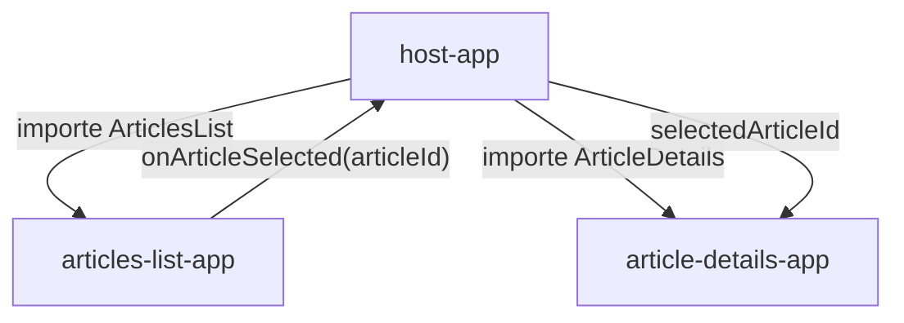

# Micro Blog Debutant

Version simple du Lab 1 pour comprendre les bases des micro-frontends avec React et Webpack Module Federation.

Cette version est volontairement minimale. Le but est de voir clairement comment un Host charge deux Remotes et comment une selection d'article circule entre les composants.

## Objectif

A la fin de cette version, vous devez comprendre :

- ce qu'est une application Host ;
- ce qu'est une application Remote ;
- comment exposer un composant avec Module Federation ;
- comment consommer un composant distant dans le Host ;
- comment transmettre une information simple entre deux remotes via le Host.

## Architecture

```text
micro-blog-debutant/
|-- package.json
|-- host-app/
|-- articles-list-app/
`-- article-details-app/
```

| Application | Port | Role |
| --- | --- | --- |
| `host-app` | `9000` | Charge les deux remotes et garde l'article selectionne. |
| `articles-list-app` | `9001` | Expose le composant `ArticlesList`. |
| `article-details-app` | `9002` | Expose le composant `ArticleDetails`. |

## Flux De Donnees



## Ce Que Montre Cette Version

- une liste simple de deux articles ;
- un clic sur un article ;
- un detail qui change selon l'article selectionne ;
- une configuration Module Federation simple ;
- une UI Bootstrap basique avec des cards.


## Guide De Lecture

Commencez par le Host `host-app`, car c est lui qui compose l interface finale. Lisez ensuite `articles-list-app` et `article-details-app` pour comprendre ce que chaque remote expose. Le fichier `webpack.config.js` de chaque application est le point central : il indique le nom de la remote, les modules exposes, les dependances partagees et le port local.

Dans cette version, gardez en tete :

- sujet du lab : Introduction aux micro-frontends ;
- competence travaillee : decouper une interface en Host et Remotes ;
- concepts importants : Module Federation, remoteEntry.js, dependances partagees ;
- ports : `9000`, `9001`, `9002`.

## Installation

Depuis le dossier `lab-1` :

```bash
cd micro-blog-debutant
npm install
npm run install:all
```

`npm install` installe les dependances du dossier courant, notamment `concurrently`.

`npm run install:all` installe les dependances des trois applications :

- `host-app`
- `articles-list-app`
- `article-details-app`

## Execution

```bash
npm run start:all
```

Cette commande lance les trois applications en meme temps.

| Application | URL |
| --- | --- |
| Host App | http://localhost:9000 |
| Articles List App | http://localhost:9001 |
| Article Details App | http://localhost:9002 |

Ouvrez le Host :

```text
http://localhost:9000
```


## Contrat Entre Les Applications

| Element | Responsabilite |
| --- | --- |
| Host `host-app` | Charge les remotes, garde l etat global utile et orchestre l interaction. |
| Remote `articles-list-app` | Fournit une partie de l interface et expose un composant consommable par le Host. |
| Remote `article-details-app` | Affiche le detail, le resultat ou la deuxieme partie du flux utilisateur. |
| `remoteEntry.js` | Fichier genere par Webpack qui permet au Host de charger une remote a distance. |
| `shared` | Section qui evite de dupliquer les dependances critiques comme React, Vue ou Angular. |

## Build

```bash
npm run build:all
```

Cette commande genere le build de production des trois applications.

## Scripts Disponibles

| Script | Description |
| --- | --- |
| `npm run install:all` | Installe les dependances des trois apps. |
| `npm run start:all` | Lance les trois apps. |
| `npm run build:all` | Build les trois apps. |
| `npm run start:host` | Lance seulement `host-app`. |
| `npm run start:articles` | Lance seulement `articles-list-app`. |
| `npm run start:details` | Lance seulement `article-details-app`. |

## Fichiers Importants

| Fichier | Description |
| --- | --- |
| `host-app/src/App.js` | Importe les deux remotes avec `React.lazy`. |
| `articles-list-app/src/ArticlesList.js` | Affiche la liste simple des articles. |
| `article-details-app/src/ArticleDetails.js` | Affiche le detail selon `selectedArticleId`. |
| `*/webpack.config.js` | Configure Module Federation. |

## Validation

Apres lancement :

- ouvrez `http://localhost:9000` ;
- verifiez que la liste des articles s'affiche ;
- cliquez sur un article ;
- verifiez que le panneau de detail change ;
- verifiez que la console navigateur ne contient pas d'erreur.

## Difference Avec La Version Advanced

La version debutant reste volontairement simple. Elle ne contient pas :

- de recherche ;
- de filtres ;
- de selection visuelle avancee ;
- de meta donnees enrichies ;
- de partage explicite de React en singleton ;
- de bootstrap asynchrone avec `import("./bootstrap")`.

Pour voir ces notions, utilisez `../micro-blog-advanced`.


## Checklist De Validation

- Le Host s ouvre sur `http://localhost:9000`.
- Les deux remotes repondent sur `http://localhost:9001` et `http://localhost:9002`.
- L interaction principale du lab fonctionne de bout en bout.
- La console navigateur ne montre pas d erreur Module Federation.
- `npm run build:all` termine sans erreur.


## Erreurs Frequentes

- **Remote introuvable** : verifiez que la remote est demarree et que le port correspond au README.
- **Port deja utilise** : arretez l ancien serveur ou utilisez la version advanced qui possede ses propres ports.
- **Dependance partagee en conflit** : comparez les versions dans les `package.json` et la section `shared`.
- **Apres un nettoyage** : relancez `npm install` puis `npm run install:all`.
