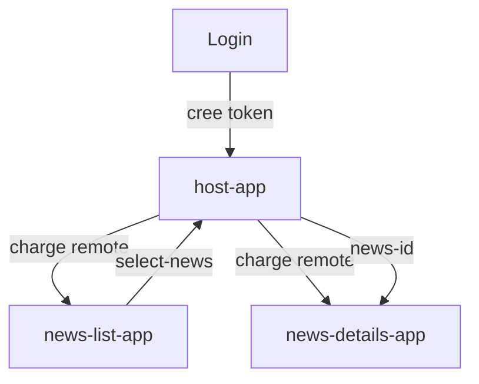

# News Dashboard Debutant

Version simple du Lab 2 pour comprendre comment proteger une architecture micro-frontend avec Vue.js.

## Objectif

Cette version montre les bases :

- une page de login dans le Host ;
- une route `/dashboard` protegee par Vue Router ;
- un token simule stocke dans `localStorage` ;
- deux remotes qui verifient le token avant d'afficher leurs donnees.

## Architecture

| Application | Port | Role |
| --- | --- | --- |
| `host-app` | `9000` | Gere le login, le token et la route protegee. |
| `news-list-app` | `9001` | Affiche la liste des actualites si le token est valide. |
| `news-details-app` | `9002` | Affiche le detail de l'actualite si le token est valide. |

## Flux




## Guide De Lecture

Commencez par le Host `host-app`, car c est lui qui compose l interface finale. Lisez ensuite `news-list-app` et `news-details-app` pour comprendre ce que chaque remote expose. Le fichier `webpack.config.js` de chaque application est le point central : il indique le nom de la remote, les modules exposes, les dependances partagees et le port local.

Dans cette version, gardez en tete :

- sujet du lab : Securite ;
- competence travaillee : proteger l acces aux remotes ;
- concepts importants : authentification simulee, token, acces refuse ;
- ports : `9000`, `9001`, `9002`.

## Installation

```bash
cd lab-2/news-dashboard-debutant
npm install
npm run install:all
```

## Execution

```bash
npm run start:all
```

Ouvrir :

```text
http://localhost:9000
```

Identifiants :

```text
user / pass
```


## Contrat Entre Les Applications

| Element | Responsabilite |
| --- | --- |
| Host `host-app` | Charge les remotes, garde l etat global utile et orchestre l interaction. |
| Remote `news-list-app` | Fournit une partie de l interface et expose un composant consommable par le Host. |
| Remote `news-details-app` | Affiche le detail, le resultat ou la deuxieme partie du flux utilisateur. |
| `remoteEntry.js` | Fichier genere par Webpack qui permet au Host de charger une remote a distance. |
| `shared` | Section qui evite de dupliquer les dependances critiques comme React, Vue ou Angular. |

## Build

```bash
npm run build:all
```

## Parcours De Test

1. Ouvrir `http://localhost:9000`.
2. Se connecter avec `user` / `pass`.
3. Cliquer sur une actualite.
4. Verifier que le detail change.
5. Supprimer `token` dans `localStorage`.
6. Recharger la page et verifier que l'acces est refuse.

## Scripts

| Script | Description |
| --- | --- |
| `npm run install:all` | Installe les dependances des trois apps. |
| `npm run start:all` | Lance les trois apps. |
| `npm run build:all` | Build les trois apps. |
| `npm run start:host` | Lance seulement le Host. |
| `npm run start:list` | Lance seulement la liste. |
| `npm run start:details` | Lance seulement le detail. |

## Difference Avec Advanced

Cette version reste minimale. Elle n'ajoute pas :

- de recherche ;
- de filtres ;
- de session visible ;
- de deconnexion avancee ;
- de details enrichis ;
- de partage explicite de `vue` en singleton.

Pour ces notions, utilisez `../news-dashboard-advanced`.


## Checklist De Validation

- Le Host s ouvre sur `http://localhost:9000`.
- Les deux remotes repondent sur `http://localhost:9001` et `http://localhost:9002`.
- L interaction principale du lab fonctionne de bout en bout.
- La console navigateur ne montre pas d erreur Module Federation.
- `npm run build:all` termine sans erreur.


## Erreurs Frequentes

- **Remote introuvable** : verifiez que la remote est demarree et que le port correspond au README.
- **Port deja utilise** : arretez l ancien serveur ou utilisez la version advanced qui possede ses propres ports.
- **Dependance partagee en conflit** : comparez les versions dans les `package.json` et la section `shared`.
- **Apres un nettoyage** : relancez `npm install` puis `npm run install:all`.
